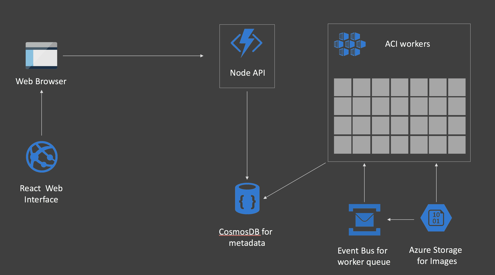

# Demo for the Open Source Summit - Edinburgh 2018

This is a challenge I set myself to use Open Source components to demonstrate how great Cloud, and specifically Azure is.

The challenge was to use Machine Learning to churn through A LOT of data and do something with it.  I wanted it to be cool, but also a good demomnstration of how Cloud Services and OSS can work together to reduce the amount of time you would need to get an MVP up and running.

## Cloud Services Used
* Cosmos DB
* Azure Service Bus
* Azure Web Apps (for Containers)
* Azure Storage
* Azure Kubernetes Service

## Open Source Frameworks and Languages used
* Node
* React
* Python
* Express
* Tensorflow and Keras


## Architecture



## Data 
For the data to ingest and test I used the [COCO unlabelled images](http://images.cocodataset.org/zips/unlabeled2017.zip)

### Important!
You can use any images you like, just put it on a storage account in a container called **images**

## Caveats
This is a demo running on Azure - as such it is tightly coupled to some of our services.  In  [infer.py](./infer/infer.py) for example, we poll on the Azure Event Hub to see when a new message is received (in this case, the relative path of an image stored on Azure Blob Storage), it is then that the infer worker will pull the message of the queue and then process it.  As we scale the pods up using ACI/Virtual Kubelet, the queueing mechanism is the key to making sure we have consistency.

# Setup the demo

You will need the following Azure Services:

* Service Bus
* CosmosDB
* Azure Blob Storage


Place the following information in the [envs_template.sh](./utils/envs_template.sh) and [infer_secrets_template.yml](./kubernetes/infer_secrets_template.yml) files.  We use the connection details for both the Inference model on Kubernetes, as well as to inject data into the Service Bus (so that the Inference workers actually do something).

## Service Bus information needed
You will need to capture:

* SERVICEBUS_NAMESPACE=*name of your Service Bus*
* SERVICEBUS_ACCESSKEY_NAME=RootManageSharedAccessKey (It's usually this)
* SERVICEBUS_ACCESSKEY=*Your Service Bus Access Key*


## CosmosDB information needed 
**This could be a kube service (MongoDB) too, it's using the pymongo and mongoose drivers in the ingest and API stages**

You will need to capture:

* MONGODB=*CosmosDB Connection String*


## Azure Storage information needed 

* STORAGE_ACCOUNT=*Storage account name*
* STORAGE_KEY=*Storage account key*


# Run the demo

## Setup Virtual Kubelet
Follow the instructions [here](https://docs.microsoft.com/en-us/azure/aks/virtual-kubelet) so get VK on your cluster.

## Setup connection secrets

Edit the file **infer_secrets_template.yml** and add your Storage, Cosmos and Service Bus credentials.

```bash
$ kubectl apply -f infer_secrets_template.yml
```

## Deploy the worker

```bash
$ kubectl apply -f infer.yml
```

You should now see a single worker sitting there (after a couple of minutes).

It wont be doing much as nothing is in the Queue.

## Push data to the worker
The script [inject.py](./utils/inject.py) will need to have environment variables set, so edit the file [envs_template.sh](./utils/envs_template.sh) with your backing credentials, and source the environment.

And run the script...

```bash
$ ./utils/inject.py
```

The script will read the list of files in your storage account and start pushing those onto the Queue.

The worker will pull each image and then try to categorise it.
 
You can check this is working by seeing the pod CPU utilisation (It should be falt out at 200%)

```bash
$ kubectl top pod
```

Now that the worker has been verified, it's time to setup the API and UI.

## Setup the API
For the demo, I used WebApp for Containers for the API.  To deploy it, spin up a WebApp instance using the container **inklin/cocoapi**.  You will need to set the environmnet variable within the WebApp dashboard for MONGODB to your CosmosDB connection string.

## Setup the Frontend
For the demo, I used WebApp for Containers for the Frontend too.

### Edit the Frontend environments
As this is a React application we have to inject environment variables at build time.  To do this, edit the file [.env.production](./stats/.env.production) and replace

```
REACT_APP_API_SERVER=https://api-osssumit.azurewebsites.net
```

with the location of the API server you installed in the previous step.

You will then need to build the React App (The Dockerfile will take care of it for you, just do a docker build -t stats .) and push your Frontend to a container registry and use that as the UI.